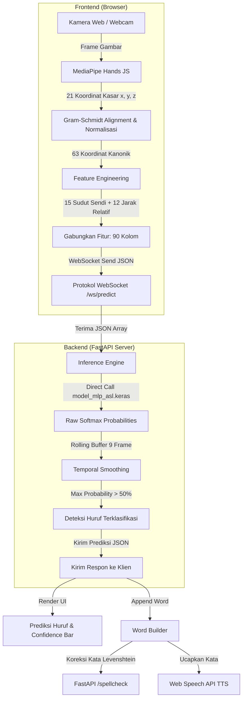
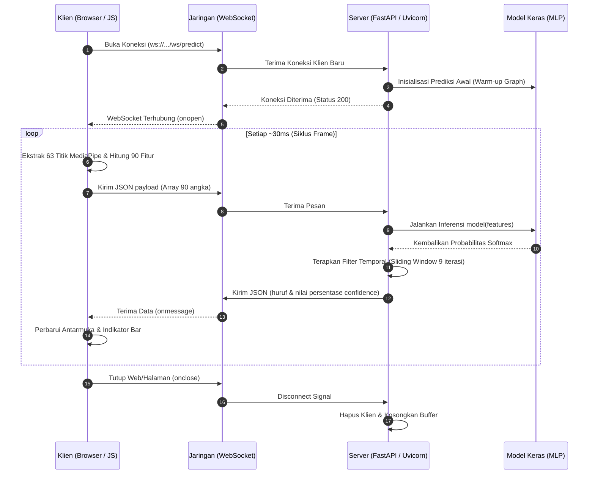

# Aplikasi Web Penerjemah American Sign Language (ASL) Real-Time (v2.1)

Aplikasi berbasis web untuk menerjemahkan bahasa isyarat American Sign Language (ASL) ke dalam teks secara real-time. Proyek ini menggunakan **Arsitektur Hibrida** (Frontend ringan + Backend API) yang dioptimalkan untuk perangkat spesifikasi rendah tanpa memerlukan GPU eksternal.

---

## Daftar Isi

1. [Fitur Utama](#-fitur-utama)
2. [Arsitektur Sistem](#-arsitektur-sistem)
3. [Spesifikasi Lingkungan & Dependensi](#-spesifikasi-lingkungan--dependensi)
4. [Petunjuk Instalasi & Cara Menjalankan](#-petunjuk-instalasi--cara-menjalankan)
5. [Pre-processing & Rekayasa Fitur](#-pre-processing--rekayasa-fitur)
6. [Siklus Koleksi Data Kustom & Pelatihan Ulang](#-siklus-koleksi-data-kustom--pelatihan-ulang)
7. [Detail Model MLP & Pelatihan](#-detail-model-mlp--pelatihan)
8. [Teknik Optimasi Latensi & Akurasi](#-teknik-optimasi-latensi--koleksi)
9. [Struktur Direktori](#-struktur-direktori)

---

## Fitur Utama

- **Deteksi Real-Time & Hibrida**: Pemrosesan gambar tangan dilakukan di sisi browser (klien) menggunakan MediaPipe, sementara klasifikasi huruf dilakukan di server via WebSocket untuk latensi sangat rendah (~30-50ms).
- **Pre-processing 90 Dimensi**: Mengekstrak 63 koordinat landmark tangan, ditambah 15 sudut sendi (_Joint Angles_) dan 12 jarak relatif (_Key Distances_) untuk akurasi tinggi dan ketahanan terhadap rotasi.
- **Normalisasi Rangka Kanonik (Canonical Frame)**: Koordinat tangan dinormalisasi terhadap posisi, skala, dan rotasi menggunakan algoritma ortogonalisasi Gram-Schmidt di sisi klien.
- **Temporal Prediction Smoothing**: Prediksi backend menggunakan rata-rata probabilitas bergerak (_sliding window_ dari 9 frame terakhir) untuk meminimalisir kedipan (_flickering_).
- **Word Builder & Spellcheck**: Pengguna dapat menyusun huruf menjadi kata dengan spasi, backspace, dan fitur koreksi kata otomatis memanfaatkan jarak Levenshtein (`pyspellchecker`).
- **Text-to-Speech (TTS)**: Tombol suara terintegrasi langsung di web menggunakan Web Speech API untuk mengucapkan kata yang telah dibangun.
- **Mode Latihan Flashcard**: Fitur gamifikasi latihan bahasa isyarat interaktif dengan sistem skor, streak (beruntun), dan huruf target acak.
- **Dashboard Analisis & Confusion Matrix**: Halaman statistik performa visual untuk menguji akurasi model per huruf secara real-time dan mengekspor Confusion Matrix dalam bentuk gambar.

---

## Arsitektur Sistem

Sistem ini membagi beban komputasi secara cerdas antara klien (Frontend) dan server (Backend) untuk mencapai efisiensi maksimal.



### Alur Komunikasi WebSocket (Sequence Diagram)
Untuk memastikan respon latensi rendah tanpa batas HTTP *overhead*, komunikasi difasilitasi dengan arsitektur *event-driven* melalui WebSocket:



---

## Spesifikasi Lingkungan & Dependensi

Agar aplikasi berjalan tanpa konflik, pastikan lingkungan pengembangan Anda memenuhi kriteria berikut:

- **Versi Python**: `3.11.0` (64-bit) sangat direkomendasikan untuk menghindari konflik biner MediaPipe dan NumPy 2.x di Windows.
- **Dependensi Utama (`requirements.txt`)**:
  - `numpy==1.26.4` (Membatasi versi di bawah NumPy 2.0)
  - `mediapipe==0.10.14` (Deteksi pose tangan)
  - `tensorflow==2.15.1` & `keras==2.15.0` (Framework Deep Learning)
  - `opencv-python==4.11.0.86` (Pengolahan gambar citra latih)
  - `pandas==3.0.2` & `scikit-learn==1.8.0` (Manipulasi dataset & preprocessing)
  - `fastapi`, `uvicorn`, `websockets` (Backend Server & Real-time protocol)
  - `pyspellchecker` (Spell checker koreksi teks bahasa Inggris)

---

## Petunjuk Instalasi & Cara Menjalankan

### 1. Kloning Repositori

Masuk ke direktori kerja proyek Anda:

```bash
cd "C:\Users\R\DOwnload\Documents\"
```

### 2. Setup Virtual Environment (Rekomendasi)

Buat dan aktifkan virtual environment agar dependensi terisolasi:

```powershell
# Menggunakan PowerShell
python -m venv venv
.\venv\Scripts\Activate
```

### 3. Instalasi Dependensi

Lakukan instalasi seluruh library yang dibutuhkan:

```bash
pip install -r requirements.txt
```

### 4. Jalankan Server Backend (FastAPI)

Jalankan server menggunakan Uvicorn di localhost dengan port 8000:

```bash
uvicorn main:app --host 0.0.0.0 --port 8000 --reload
```

Server backend akan dimuat, melakukan _warm-up_ model TensorFlow, dan siap mendengarkan WebSocket pada `ws://localhost:8000/ws/predict`.

### 5. Akses Aplikasi Frontend

Karena aplikasi sekarang dilayani langsung oleh FastAPI, Anda tidak perlu membuka file HTML secara terpisah atau menggunakan ekstensi Live Server. Cukup buka browser dan akses:

- **Aplikasi Utama**: Akses `http://localhost:8000` - Halaman utama untuk penerjemah ASL, TTS, dan Flashcard.
- **Kolektor Data & Analisis**: Buka file HTML di dalam folder `tools/` (seperti `collect_data.html` dan `stats.html`) langsung di browser jika ingin merekam gestur baru atau melihat metrik.

---

## Pre-processing & Rekayasa Fitur

Untuk menghasilkan model yang ringan namun akurat, koordinat mentah MediaPipe diproses menjadi 90 fitur representatif:

```
┌────────────────────────────────────────────────────────────────────────────────────────┐
│                              TOTAL INPUT FITUR (90 Kolom)                               │
├─────────────────────────────────────┬──────────────────────────┬───────────────────────┤
│    63 Koordinat Tangan Ter-align     │   15 Sudut Ruas Jari    │   12 Jarak Kunci      │
│     (21 Titik Landmark x, y, z)     │  (Rotation & Scale Inv)  │   (Scale Normalized)  │
└─────────────────────────────────────┴──────────────────────────┴───────────────────────┘
```

### 1. Normalisasi Posisi & Skala

- **Translasi**: Titik pergelangan tangan (Landmark 0 - Wrist) digunakan sebagai titik asal `(0,0,0)`. Seluruh titik landmark lainnya dikurangi dengan koordinat pergelangan tangan.
- **Skala**: Seluruh koordinat dibagi dengan jarak Euclidean antara Landmark 0 (Wrist) ke Landmark 9 (Middle Finger MCP). Hal ini membuat deteksi tidak terpengaruh oleh jarak tangan ke kamera (_Scale-Invariant_).

### 2. Penyelarasan Rotasi (Gram-Schmidt Canonical Frame)

Rotasi tangan diatasi dengan memproyeksikan seluruh koordinat 3D ke basis ortogonal baru (telapak tangan menghadap ke depan secara standar):

- **Vektor Forward ($u$)**: Arah dari Landmark 0 ke Landmark 9 (Arah vertikal telapak tangan).
- **Vektor Side ($v$)**: Arah ortogonal telapak tangan ke samping, dibangun dari proyeksi Landmark 17 (Pinky MCP) tegak lurus dengan $u$.
- **Vektor Normal ($w$)**: Hasil dari perkalian silang (_cross product_) $u \times v$.
  Semua koordinat 3D dikalikan dengan matriks rotasi basis $[u, v, w]^T$ untuk menghasilkan koordinat kanonik.

### 3. Fitur Tambahan (Feature Engineering)

- **15 Sudut Sendi (Angle Features)**: Dihitung pada setiap titik tengah sendi jari dari 15 triplet landmark ($A, B, C$) menggunakan rumus:
  $$\theta = \arccos\left(\frac{\vec{BA} \cdot \vec{BC}}{|\vec{BA}| \times |\vec{BC}|}\right)$$
  Fitur ini sangat stabil terhadap perputaran telapak tangan karena murni mengukur kelenturan jari.
- **12 Jarak Kunci (Distance Features)**: Mengukur jarak Euclidean antar ujung-ujung jari (Jempol ke Telunjuk, Tengah, Manis, Kelingking), jarak antar ujung jari yang berdekatan (untuk membedakan huruf `U`, `V`, dan `R`), serta jarak ujung jari ke pergelangan tangan (melihat tangan terkepal atau terbuka).

---

## Siklus Koleksi Data Kustom & Pelatihan Ulang

Jika model kurang mengenali gestur tangan Anda atau Anda ingin menambahkan kelas gerakan baru, gunakan siklus berikut:

```mermaid
flowchart LR
    A[Buka collect_data.html] --> B[Pilih Huruf & Jumlah Target]
    B --> C[Klik Rekam & Lakukan Pose]
    C --> D[Klik Export CSV]
    D -->|Simpan File| E[Unduh custom_data.csv]
    E --> F[Jalankan custom_merge.py]
    F -->|Gabungkan ke landmarks_temp.csv| G[Jalankan train.py]
    G -->|Retrain MLP Model| H[Terbentuk model_mlp_asl.keras]
    H --> I[Restart main.py Server]
```



### Langkah Penggabungan & Pelatihan Ulang:

1. Pindahkan file CSV hasil rekaman dari unduhan browser ke direktori `training/data/`.
2. Jalankan skrip penggabungan dari dalam folder `training/`:
   ```bash
   cd training
   python custom_merge.py data/landmarks_temp.csv data/nama_file_kustom_anda.csv
   ```
3. Hapus model lama dan jalankan pelatihan ulang:
   ```bash
   python train.py
   ```
   _Catatan_: Jika Anda ingin mengekstrak ulang seluruh dataset mentah di folder `training/dataset_asl`, hapus berkas `landmarks_temp.csv` terlebih dahulu, lalu jalankan `train.py`.

---

## Detail Model MLP & Pelatihan

Model yang digunakan adalah Multi-Layer Perceptron (MLP) yang sangat efisien namun tangguh.

### Arsitektur Model:

1. **Input Layer**: 90 Fitur (Landmarks, Sudut, Jarak)
2. **Dense Layer 1**: 512 Unit + ReLU + Batch Normalization + Dropout (40%)
3. **Dense Layer 2**: 256 Unit + ReLU + Batch Normalization + Dropout (35%)
4. **Dense Layer 3**: 128 Unit + ReLU + Batch Normalization + Dropout (30%)
5. **Dense Layer 4**: 64 Unit + ReLU + Batch Normalization + Dropout (20%)
6. **Output Layer**: 29 Kelas (A-Z, del, space, nothing) + Softmax

### Strategi Pelatihan (`train.py`):

- **Optimizer**: `AdamW` (Adam dengan weight decay `1e-4` terintegrasi untuk mencegah overfitting).
- **Label Smoothing**: Menggunakan nilai `0.1` pada fungsi Categorical Crossentropy untuk memperhalus target probabilitas (dari `[0, 1]` menjadi `[0.05, 0.95]`). Ini meningkatkan ketahanan model terhadap kesalahan label data latih.
- **Callbacks**:
  - `EarlyStopping`: Berhenti jika akurasi data validasi tidak meningkat selama 12 epoch.
  - `ReduceLROnPlateau`: Memotong learning rate menjadi setengahnya jika loss validasi mengalami kebuntuan selama 6 epoch.
  - `ModelCheckpoint`: Otomatis menyimpan bobot model terbaik berdasarkan akurasi validasi tertinggi.

---

## Teknik Optimasi Latensi & Akurasi

Untuk memastikan aplikasi berjalan dengan mulus di perangkat klien dan server tanpa delay, beberapa optimasi khusus diimplementasikan:

1. **Direct TensorFlow Graph Execution (di Backend)**:
   Di `main.py`, alur inferensi menggunakan pemanggilan fungsi kelas model secara langsung (`model(features)`) ketimbang `model.predict()`. Ini memangkas _overhead_ internal TensorFlow untuk ukuran batch 1, **meningkatkan kecepatan inferensi hingga 2x-5x lipat**.
2. **Model Graph Warm-Up**:
   Saat server FastAPI dimulai (_startup lifespan_), server mengirimkan satu sampel tiruan (zero matrix) ke model untuk menyusun grafik TF. Hal ini mencegah terjadinya latensi tinggi (ngadat) pada frame deteksi pertama ketika klien terhubung.
3. **Temporal Rolling Average (Smoothing)**:
   Untuk mengurangi getaran deteksi akibat noise visual latar belakang, backend menyimpan 9 prediksi probabilitas terakhir dalam antrean `deque` per koneksi WebSocket. Klasifikasi akhir diambil dari rata-rata probabilitas terhalus.
4. **Data Augmentasi Lanjut**:
   Selama proses pembuatan dataset di `train.py`, setiap sampel foto tangan diaugmentasi secara otomatis sebanyak **12 kali** menggunakan:
   - Pencerminan sumbu X (untuk mengenali tangan kiri dan kanan secara adil).
   - Penambahan Gaussian Noise (simulasi getaran kamera).
   - Variasi Skala sebesar $\pm 10\%$.
   - Rotasi 3D sebesar $\pm 10^\circ$ di tiga sumbu ($x, y, z$).

---

## Struktur Direktori

Berikut adalah susunan file utama dalam proyek ini:

```
asl-dump-hibrid/
│
├── training/               # Folder khusus untuk melatih ulang model (ML/Data Science)
│   ├── dataset_asl/        # Direktori berisi folder citra latih per huruf (A-Z, space, dll)
│   ├── data/               # Direktori menyimpan dataset CSV (landmarks_temp.csv, dll)
│   ├── train.py            # Pipeline ekstraksi fitur, augmentasi data, & pelatihan MLP
│   └── custom_merge.py     # Alat bantu CLI penggabung CSV data kustom ke dataset utama
│
├── tools/                  # Halaman statis tambahan
│   ├── collect_data.html   # Antarmuka perekam data kustom via kamera klien
│   └── stats.html          # Antarmuka visual Confusion Matrix & real-time tester
│
├── docs/                   # Direktori Dokumentasi Proyek
│   ├── PRD.md              # Product Requirements Document
│   └── design.md           # Spesifikasi Desain Sistem & Tema
│
├── assets/                 # Aset Frontend (CSS, JS, Ikon, Gambar)
│
├── main.py                 # Backend API FastAPI, WebSocket Classifier, & Melayani Frontend
├── index.html              # Aplikasi antarmuka web utama (Penerjemah, TTS, Flashcard)
├── Dockerfile              # Konfigurasi container untuk mempermudah deployment
├── requirements.txt        # Daftar library python yang wajib diinstal
├── model_mlp_asl.keras     # Berkas model biner hasil pelatihan
├── classes.npy             # Mapping kelas biner NumPy untuk huruf keluaran
└── README.md               # Dokumentasi Proyek (Berkas ini)
```

---

_Catatan Presentasi_: Jalankan server FastAPI terlebih dahulu sebelum membuka halaman HTML mana pun agar koneksi WebSocket berjalan dengan sukses. Pastikan kamera laptop Anda bersih dan memiliki pencahayaan yang cukup untuk deteksi MediaPipe yang optimal.
