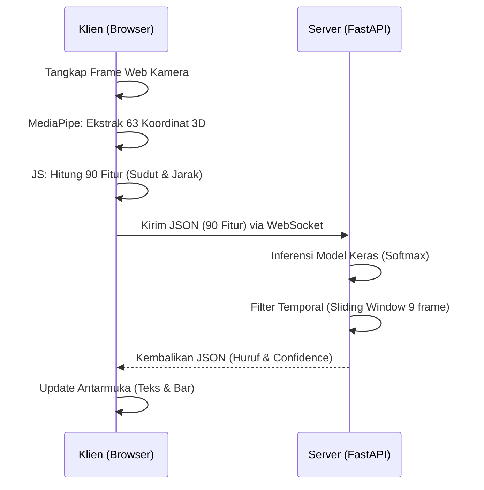

# Product Requirements Document (PRD)
## Aplikasi Web Penerjemah American Sign Language (ASL) Real-Time

### 1. Tujuan Proyek
Membangun alat penerjemah bahasa isyarat ke teks secara langsung (real-time) yang berjalan lancar di perangkat dengan spesifikasi rendah (tanpa GPU eksternal). Aplikasi ini ditujukan untuk memfasilitasi komunikasi antara pengguna bahasa isyarat (Tuli/Teman Tuli) dengan masyarakat umum secara instan, serta sebagai sarana edukasi interaktif (Flashcard & Evaluasi Akurasi).

### 2. Target Audiens
- **Teman Tuli & Teman Dengar:** Membantu komunikasi sehari-hari tanpa hambatan bahasa.
- **Pelajar Bahasa Isyarat:** Membutuhkan umpan balik real-time mengenai akurasi gestur tangan mereka (dilengkapi fitur Flashcard).
- **Peneliti/Developer:** Sebagai referensi proyek Machine Learning dengan latensi rendah menggunakan arsitektur hibrida klien-server.

### 3. Fitur Utama
- **Deteksi Real-Time (Latensi ~30-50ms):** Pemrosesan citra dilakukan di klien, dan inferensi dilakukan di server via WebSocket.
- **Pre-processing 90 Dimensi:** Ekstraksi 63 koordinat 3D, 15 sudut sendi jari, dan 12 jarak relatif.
- **Normalisasi Rangka Kanonik (Gram-Schmidt):** Tahan terhadap perubahan rotasi, ukuran tangan, dan jarak dari kamera.
- **Word Builder & Spellcheck:** Fitur perangkaian huruf menjadi kata dengan spasi, penghapusan, dan koreksi kata otomatis menggunakan jarak Levenshtein.
- **Text-to-Speech (TTS):** Mengucapkan kata yang telah dibangun menggunakan Web Speech API.
- **Dashboard Analisis:** Menampilkan statistik metrik per huruf dan *confusion matrix* secara visual.
- **Pengumpulan Data Kustom:** Antarmuka khusus untuk merekam dataset baru untuk huruf/isyarat spesifik.

### 4. Kebutuhan Non-Fungsional
- **Efisiensi Perangkat Keras:** Server harus dapat berjalan hanya dengan CPU (menggunakan TensorFlow CPU version).
- **Privasi:** Gambar/video dari kamera tidak pernah dikirim ke server. Hanya koordinat angka (array 90 elemen) yang dikirim melalui WebSocket.
- **Reliabilitas Koneksi:** WebSocket harus mampu menangani antrean data secara efisien dan mendukung banyak koneksi ringan tanpa tersumbat (*bottleneck*).

### 5. Tumpukan Teknologi (Tech Stack)
- **Frontend:** HTML5, CSS3, Vanilla JavaScript, MediaPipe Hands (CDN).
- **Backend:** Python 3.11, FastAPI, Uvicorn, WebSockets.
- **Machine Learning:** TensorFlow/Keras (Model Multi-Layer Perceptron), Scikit-Learn (Preprocessing), NumPy.
- **Utilitas Tambahan:** OpenCV, PySpellChecker (koreksi teks otomatis).

### 6. Alur Komunikasi Sistem

